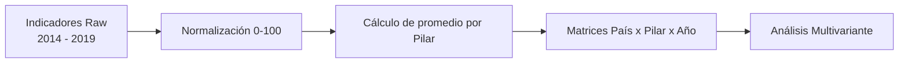

# Coherencia, Estabilidad y Discontinuidades del Índice de Competitividad Global (GCI)

Un estudio multivariante para el período 2014–2019 

Trabajo Final de Magíster
Universidad Bernardo O’Higgins
Santiago, Chile – 2025

Autor: Ariel Ignacio Núñez Salinas

## Descripción del Proyecto

Este proyecto analiza la estructura temporal de los 12 pilares del Índice de Competitividad Global (GCI) publicado por el World Economic Forum durante el período 2014–2019. Existieron 2 metodologías:

> GCI 3.0 → usado hasta 2017
>
> GCI 4.0 → introducida en 2018

Esta transisción modificó

- Definición de indicadores
- Normalización de la escala (1–7 → 0–100)
- Composición de pilares
- Logica de agrupamiento

El proyecto aborda el siguiente problema:
    
> Es el GCI comparable estructuralmente a lo largo del periodo 2014-2019, o la transición metodológica genera una discontinuidad estadística detectable?
    
Para abordar esto, se implementa un enfoque multivariante combinando:

- Análisis Descriptivo
- Agrupamiento Jerárquico
- PCA
- HJ-Biplot
- STATIS

El objetivo no es solo replicar rankings, sino evaluar coherencia estructural, estabilidad y discontinuidades internas del índice.

## Objetivos de análisis

1. Evaluar la consistencia temporal de los pilares.
2. Detectar pilares sensibles a cambios metodológicos o shocks económicos.
3. Clasificar países según perfiles competitivos.
4. Analizar estructura de correlaciones entre pilares.
5. Identificar rupturas estructurales entre GCI 3.0 y GCI 4.0.

## Metodología General

El pipeline sigue esta estructura lógica:

### Datos

**Fuente**: Reportes (pdf) del Foro Económico Mundial (2014 - 2019)

Características de la Data:
- 55 países
- 12 pilares
- Periodo 2014–2019

**N° de Indicadores por año**:
- 109 (2014–2017)
- 92 (2018)
- 98 (2019)

Missing data < 4%

Principal limitante:
Sólo 5 indicadores permanecen constante a lo largo de los 6 años. Una comparación a nivel de indicadores es por lo tanto inestable estadísticamente.

## Principales desiciones

### Normalización unificada (0–100)

El problema de las escalas por metodología:
> GCI 3.0: escala 1–7
>
> GCI 4.0: escala 0–100

**Desición**
> Todos los indicadores seran re-escalados utilizando la normalización 0 - 100 de la metodología GCI 4.0.

Esto asegura la homogenidad de la métrica. Previene variaciones artificiales de inflación, preserva la monotocidad y permite una comparación estructural a nivel de pilares.

### Nivel de Agregación: Pillar > Indicador

Issue
Indicator definitions change across years.

Decision
Compute pillar-level scores as:

$$
    P_{k,j} = \frac{1}{n_j}\sum_{i in j}{sc_{i,k}}
$$

Donde:
- $k$ es el país
- $j$ es el pilar
- $sc_{i,k}$ es el score del indicador normalizado

Esto reduce la inestabilidad dimensional, mejora la robustes de las técnicas PCA y STATIS y reduce el ruido de la relocalización de los indicadores.

4.3 Missing Data Strategy

Missingness < 4%.

Decision
No complex imputation performed.

Rationale

Low proportion.

Avoid bias injection.

Structural methods (PCA, clustering) remain stable.

4.4 Categorical Enrichment

Two categorical variables introduced:

- BLOK: geographic region
- ORG: institutional group
    - OECD
    - BRICS

Purpose

Validate cluster coherence.

Examine structural heterogeneity.

Provide interpretability layer.
